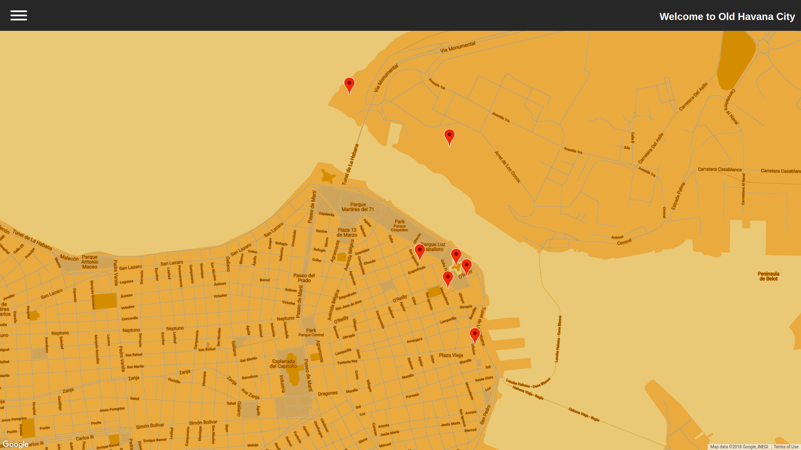

# Old Havana Map
This is the final project of  [Udacity Front-End Developer Nanodegree](https://eu.udacity.com/course/front-end-web-developer-nanodegree--nd001).
## Table of content
* [Descriptions](#description)
* [Getting started](#getting-started)
* [Build width](#build-width)
* [App Struture](#app-structure)
* [Contributing](#contributing)
* [Authors](#authors)

### Description
This is a single page web application that allows the user to search for the location of old buildings(with more than 200 year) In Havana,Cuba.



### Getting started
Open the terminal and run following command
- `cd map-app`
- `npm install`
- `npm start`
- The application will open in your browser at the address: `localhost:3000`

### Build width
This project was created with 
- [REACT](https://reactjs.org/)
- [Google Maps API](https://cloud.google.com/maps-platform/)
- [Wikipedia API](https://www.mediawiki.org/wiki/API:Main_page) 
#### Third Libraries
- [escape-string-regexp](https://github.com/sindresorhus/escape-string-regexp)
- [fetch-jsonp](https://github.com/camsong/fetch-jsonp)
- [react-google-maps](https://github.com/to9mchentw/react-google-maps)
- [recompose](https://github.com/acdlite/recompose)

### App Structure
The App have the following structure with REACT components.
```bash
└── Index
   └── App
        └── Head
        ├── SideBar
        └── MyMap
            └── Map

```


### Contributing
This repository is the last project of _Udacity's Nanodegree_. Therefore, we most likely will not accept pull requests. 

## Authors

**Dieter Jackson**